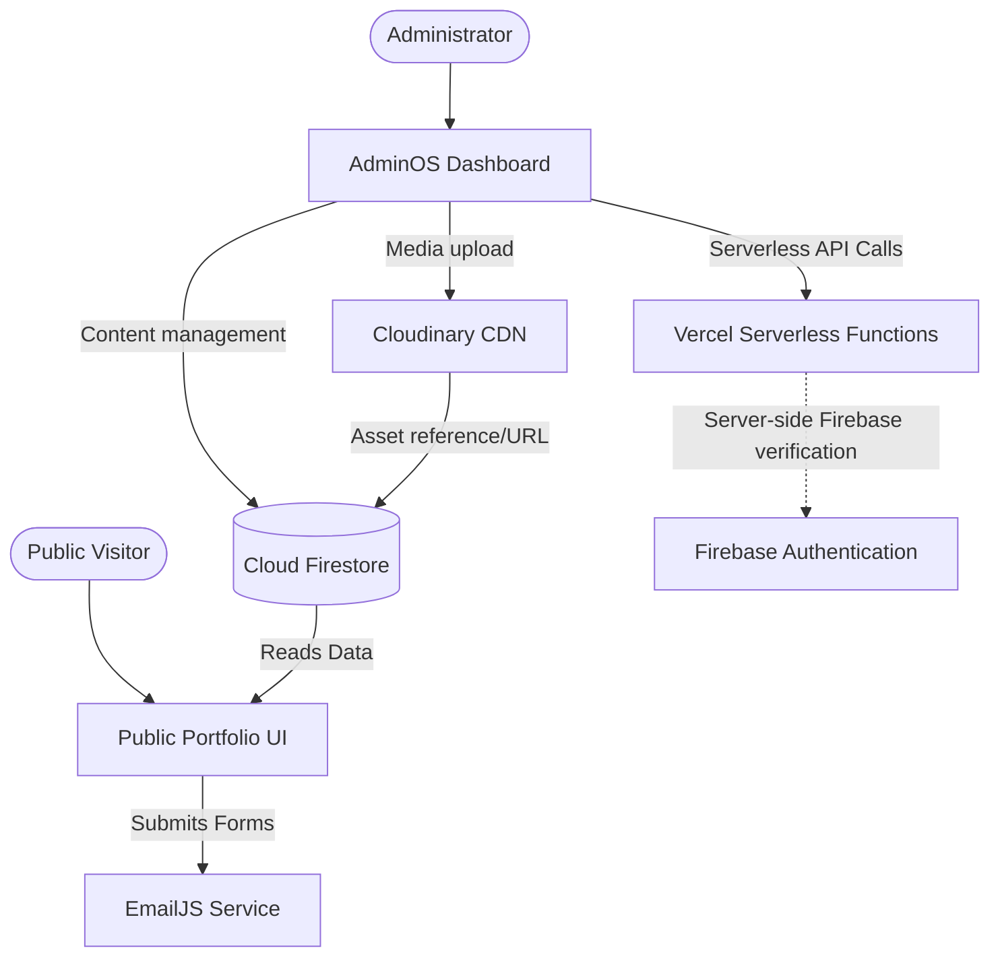

<div align="center">

# Abdelrahman El-bahnsy
### Cloud & DevOps Engineer

*A serverless portfolio platform featuring a responsive public experience and a secure, role-aware AdminOS content management system.*

[🌐 Live Portfolio](https://abdelrahman-el-bahnsy.vercel.app/) &nbsp;&middot;&nbsp; [⚙️ AdminOS](https://abdelrahman-el-bahnsy.vercel.app/admin/overview) &nbsp;&middot;&nbsp; [📦 Repository](https://github.com/AbdelrahmanElbahnsy/Abdelrahman-Portfolio-main)

</div>

<br />

## 📊 Project Snapshot

| Area | Implementation |
|---|---|
| **Frontend** | React 19 + Vite |
| **Styling** | Tailwind CSS |
| **Authentication** | Firebase Authentication |
| **Database** | Cloud Firestore |
| **Media Management** | Cloudinary |
| **Communications** | EmailJS |
| **Hosting & Functions** | Vercel |
| **Content Management** | AdminOS (Custom Internal CMS) |
| **Access Control** | Firebase Auth + Firestore RBAC |

---

## 📖 Overview

This repository houses a serverless web application that serves as a dynamic professional portfolio. Rather than a static site, this platform is deeply integrated with a custom backend content management system known as **AdminOS**. 

The **AdminOS** allows authorized users to manage all portfolio data—including projects, skills, journey milestones, certifications, and settings—directly from a secure dashboard. The public portfolio dynamically consumes this content via Cloud Firestore. Authentication, role-based authorization (RBAC), and strict Firestore rules secure all administrative functionality.

---

## 🚀 Live Product

### Public Portfolio
The public-facing application showcases my professional experience, skills, projects, and certifications. It features internationalization (Arabic/English), theme toggling (Dark/Light), and fluid animations.

**URL:** [https://abdelrahman-el-bahnsy.vercel.app/](https://abdelrahman-el-bahnsy.vercel.app/)


<br />

### AdminOS
The secure internal dashboard used for comprehensive content management and system administration. It is fully role-protected and strictly enforces authentication.

**URL:** [https://abdelrahman-el-bahnsy.vercel.app/admin/overview](https://abdelrahman-el-bahnsy.vercel.app/admin/overview)


---

## ✨ Key Features

### Public Portfolio
- **Dynamic Content:** Hero, About, Skills, Projects, Certifications, Journey, and Contact sections fully driven by Firestore data.
- **Internationalization:** Seamless Arabic and English language support.
- **Theming:** Integrated Dark and Light modes.
- **Animations:** Fluid interactions powered by GSAP and Framer Motion.
- **Responsiveness:** Fully responsive behavior from mobile screens to ultrawide desktops.

### AdminOS
The AdminOS features dedicated modules for managing all aspects of the platform:
- **Dashboard & Analytics:** Overview metrics and site settings.
- **Content Modules:** Manage Projects, Skills, Certifications, Journey, Hero, About, Navbar, and Contact data.
- **Media Library:** Direct integration with Cloudinary for asset uploads and management.
- **User Management:** Role-aware user administration backed by server-side authorization.
- **Account & Profile:** Personal profile and security configurations.

---

## 🔄 Content Management Model

The application operates on a centralized, Firestore-backed content management model:

```
AdminOS (Editors / Admins)
       │
       ▼ (Secure Writes)
 Cloud Firestore
       │
       ▼ (Public Reads)
 Public Portfolio
```

AdminOS manages and structures the data via protected write operations. The public portfolio acts as a read-only consumer of that structured content, resulting in immediate UI updates when data changes in Firestore.

---

## 🏗️ Architecture & Data Flow



- **Media Flow:** `AdminOS` → `Cloudinary` → `Firestore (Metadata)` → `Public Portfolio`.
- **Contact Flow:** `Public Portfolio` → `EmailJS`.

---

## 🛡️ Security Architecture

The platform prioritizes security across the stack, implementing strict controls to separate public consumption from administrative capabilities.

### Authentication & Authorization (RBAC)
All administrative routes are protected by Firebase Authentication. The system implements a granular Role-Based Access Control model with four distinct tiers:
- **Owner:** Highest privilege level with full administrative access.
- **Admin:** System administration, User Management, and content editing.
- **Editor:** Access to manage content and media, but no User Management capabilities.
- **Viewer:** Read-only access to the AdminOS dashboard.

### Server-Side Verification
User Management and sensitive API actions are protected by Vercel Serverless Functions (e.g., `api/admin/users.js`). The API enforces server-side token validation and explicit role checks before permitting the Firebase Admin SDK to execute account creations, updates, or deletions. 

### Firestore Security Rules
Firestore rules (`firestore.rules`) enforce a strict access posture:
- **Public Read:** Intentional read access to portfolio data collections (`hero`, `projects`, `skills`, etc.).
- **Protected Writes:** Create/Update operations strictly require `isEditor()` privileges.
- **Schema Validation:** Field-level type validation ensures data integrity (e.g., `isValidString`, `isValidNumber`) before any write is permitted.
- **Default Deny:** All unmapped collections default to absolute denial (`allow read, write: if false;`).

### Additional Controls
- **URL Security:** Dynamic CMS URLs are validated through a dedicated safeUrl utility before rendering.
- **Security Headers:** Enforced via `vercel.json`, including `Strict-Transport-Security (HSTS)`, `X-Content-Type-Options: nosniff`, `X-Frame-Options: DENY`, and `Permissions-Policy`.
- **CORS:** Serverless APIs enforce robust Cross-Origin Resource Sharing restrictions.
- **Credential Isolation:** The Firebase Admin SDK utilizes isolated server-side environment variables (`process.env`) entirely separate from the client-exposed Vite (`VITE_*`) variables. 
- **Git History Sanitization:** Legacy credential-related historical data has been completely eradicated from the repository's reachable Git history.

---

## 🛠️ Technology Stack

| Category | Technologies |
|---|---|
| **Frontend Framework** | React 19, Vite, React Router DOM |
| **Styling & UI** | Tailwind CSS, Lucide React, React Icons |
| **Animations** | GSAP, Framer Motion, tsParticles |
| **Data & Auth** | Firebase (Auth & Firestore), Firebase Admin SDK |
| **Integrations** | Cloudinary (Media), EmailJS (Contact Forms) |
| **Infrastructure** | Vercel (Hosting & Serverless APIs) |
| **Dev Tooling** | ESLint, PostCSS, Playwright (Testing framework) |

---

## ⚙️ Engineering Highlights

- Firestore-backed CMS architecture shared by AdminOS and the public portfolio.
- Firebase Authentication with role-based authorization.
- Server-side Firebase token verification for protected administrative APIs.
- Firestore security rules with field-level validation.
- Cloudinary-based media workflow with Firestore metadata.
- Production security headers and explicit API CORS configuration.
- Dedicated CMS URL validation for dynamic links.
- Responsive AdminOS designed for desktop and mobile workflows.

---

## 📱 Responsive & UX Capabilities

The application has been engineered to deliver a premium user experience across all devices:
- **Responsive Layouts:** Both the Public Portfolio and AdminOS adapt fluidly from mobile displays to large desktop monitors.
- **Adaptive Components:** Modals, tables, and navigation elements behave intelligently based on viewport constraints.
- **Thematic Consistency:** Deeply integrated CSS variables power seamless transitions between Dark and Light appearances.
- **Bilingual Interface:** Robust Arabic (RTL) and English (LTR) language support built directly into the UI state.

---

## 📁 Repository Structure

The repository maintains a clean, professional organization, separating application source code from documentation and operational scripts.

```text
.
├── api/             # Vercel Serverless Functions (Backend APIs)
├── docs/            # Project documentation and assets
│   ├── assets/      
│   ├── audits/      
│   ├── history/     
│   ├── scratch/     
│   └── screenshots/ 
├── public/          # Static public assets
├── scripts/         # Operational tooling
│   ├── audit/       
│   ├── maintenance/ 
│   └── verification/
├── src/             # Application Source Code (React)
├── package.json     # Project dependencies and scripts
├── vite.config.js   # Vite build configuration
├── firebase.json    # Firebase configuration
├── firestore.rules  # Firestore security rules
└── vercel.json      # Vercel hosting, rewrites, and security headers
```

---

## 💻 Getting Started

### 1. Requirements
- Node.js (v18 or higher recommended)
- Firebase Project (with Auth and Firestore enabled)
- Cloudinary Account
- EmailJS Account

### 2. Clone the Repository
```bash
git clone https://github.com/AbdelrahmanElbahnsy/Abdelrahman-Portfolio-main.git
cd Abdelrahman-Portfolio-main
```

### 3. Install Dependencies
```bash
npm install
```

### 4. Environment Configuration
Copy the `.env.example` file to create your local `.env`:
```bash
cp .env.example .env
```
Provide the required keys. 
> ⚠️ **IMPORTANT:** Never commit your `.env` file or expose real credentials to Git.

**Client-Side Variables (`VITE_*`)**
These are safely exposed to the browser for Firebase initialization, Cloudinary uploads, and EmailJS configuration.
```env
VITE_FIREBASE_API_KEY="..."
VITE_CLOUDINARY_CLOUD_NAME="..."
# ...
```

**Server-Side Variables**
These are strictly for Vercel Serverless Functions and must *never* be prefixed with `VITE_`.
```env
FIREBASE_PROJECT_ID="..."
FIREBASE_CLIENT_EMAIL="..."
FIREBASE_PRIVATE_KEY="..."
OWNER_EMAILS="..."
```

### 5. Start the Development Server
```bash
npm run dev
```
The application will be available at `http://localhost:5173`.

### 6. Production Build
```bash
npm run build
```

---

## 🔮 Roadmap / Future Work
- **Firebase App Check:** Implement robust App Check (reCAPTCHA Enterprise) to further protect backend services.
- **Server-Side Rate Limiting:** Enforce strict rate limits on the EmailJS contact submission flow to prevent abuse.
- **Dependency Modernization:** Keep the Firebase Admin SDK updated in alignment with emerging serverless best practices.

---

<div align="center">

**Abdelrahman El-bahnsy**  
*Cloud & DevOps Engineer*

[Portfolio](https://abdelrahman-el-bahnsy.vercel.app/) &nbsp;&middot;&nbsp; [GitHub](https://github.com/AbdelrahmanElbahnsy)

</div>
