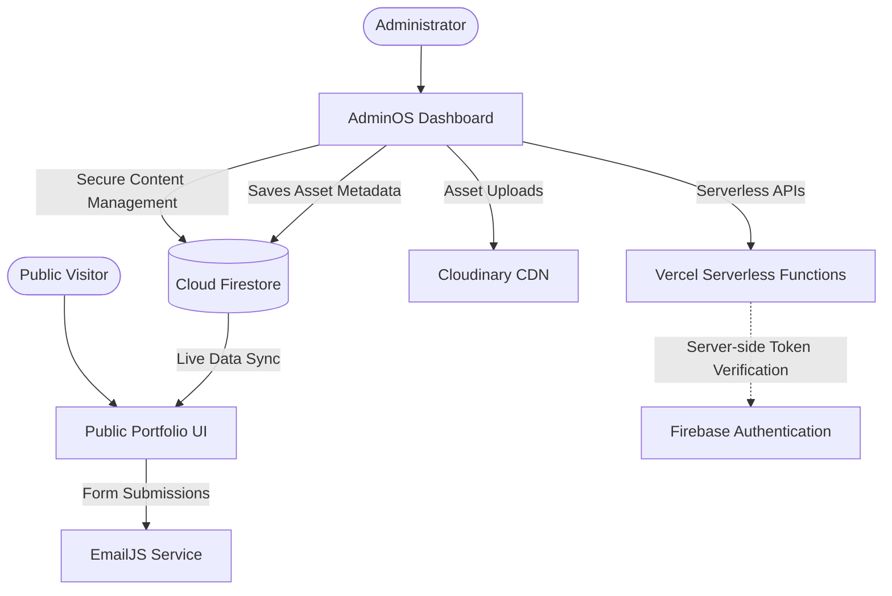

<div align="center">

# Abdelrahman El-bahnsy
### Cloud & DevOps Engineer

> A serverless portfolio platform featuring a custom Firestore-backed CMS (AdminOS), strict role-aware authorization, centralized media management, and a responsive bilingual public experience.

[🌐 Live Portfolio](https://abdelrahman-el-bahnsy.vercel.app/) &nbsp;&middot;&nbsp; [⚙️ AdminOS](https://abdelrahman-el-bahnsy.vercel.app/admin/overview) &nbsp;&middot;&nbsp; [📦 Repository](https://github.com/AbdelrahmanElbahnsy/Abdelrahman-Portfolio-main)

<br />


</div>

<br />

## 👁️ Visual Showcase

### The Public Experience
A highly polished, responsive interface serving dynamic content directly from the Cloud Firestore backend.

<div align="center">
  
</div>

### AdminOS (Content Management System)
A fully authenticated, role-protected dashboard where authorized administrators and editors manage every aspect of the portfolio's data.

<div align="center">
  
</div>

---

## 🚀 Why This Project Is Different

This repository goes far beyond a standard static portfolio. It represents a fully engineered, decoupled **Content Management Architecture**. 

Instead of hardcoding personal data into source files, every major section of the public portfolio—including projects, skills, certifications, and hero text—is consumed dynamically from a NoSQL database. The **AdminOS** acts as a secure, role-restricted internal product used to manage that data. This architecture demonstrates practical implementations of serverless API security, Firebase authorization rules, media abstraction, and real-time state synchronization.

---

## 📦 Core Product Overview

### 1. Public Portfolio
The public-facing frontend is optimized for performance, accessibility, and fluid user experience.
- **Dynamic CMS Consumption:** Hero, About, Skills, Projects, Certifications, Journey, Contact, and Navbar content are all rendered live from Firestore.
- **Bilingual Interface:** Deeply integrated Arabic (RTL) and English (LTR) support managed through React Context.
- **Thematic Consistency:** CSS variable-driven Dark and Light modes.
- **Responsive Engineering:** Fluid typography and layout adaptations from mobile viewports to ultrawide displays.
- **Animation System:** Scroll-triggered micro-interactions powered by GSAP and Framer Motion.

### 2. AdminOS
A comprehensive, secure internal administration panel built on a modular architecture.
- **Dashboard & Analytics:** High-level metrics, system health, and page visit insights.
- **Content Modules:** Dedicated CRUD interfaces for managing Projects, Skills, Certifications, Journey milestones, Hero content, About descriptions, and Contact information.
- **Media Library:** Direct integration with Cloudinary for uploading and managing visual assets, complete with a custom media picker.
- **Account Center:** Profile management and secure authentication flows.
- **Settings:** Global site configuration, including theme enforcement and portfolio visibility toggles.

---

## 🏗️ Architecture & Data Flow

The platform relies on a unidirectional content flow where AdminOS acts as the authorized writer, and the Public Portfolio acts as the consumer.



---

## 🛡️ Security Architecture

Security is implemented at multiple layers, protecting both the client application and the backend infrastructure.

### Role-Based Access Control (RBAC)
Firebase Authentication handles identity, while a dedicated Firestore `admins` collection enforces roles.

| Role | Access Level |
|---|---|
| **Owner** | Highest privilege. Full access to content, settings, and user administration. |
| **Admin** | System administration, user management (excluding Owners), and content editing. |
| **Editor** | Authorized to manage content and media assets. Cannot modify users. |
| **Viewer** | Read-only access to the AdminOS dashboard. |

### Server-Side API Security
Administrative actions, such as user creation or role modification, are processed through Vercel Serverless Functions (e.g., `api/admin/users.js`). These endpoints explicitly verify the caller's Firebase Auth token and cross-reference their Firestore role before leveraging the privileged Firebase Admin SDK.

### Firestore Rules & Schema Validation
The `firestore.rules` configuration enforces a strict security posture:
- **Public Reads:** Specific collections (`projects`, `skills`, etc.) allow unauthenticated reads for the public portfolio.
- **Protected Writes:** Create, update, and delete operations strictly require the `isEditor()` privilege.
- **Type Safety:** Field-level schema validation (e.g., `isValidString`, `isValidNumber`) prevents malformed or malicious data injection.
- **Default Deny:** The configuration falls back to an absolute deny for unmapped paths.

### Additional Hardening
- **Dynamic URL Safety:** CMS-provided links are sanitized via a dedicated `safeUrl` utility before rendering, mitigating injection risks.
- **Security Headers & CORS:** Configured via `vercel.json` and explicit API logic to enforce `Strict-Transport-Security`, `X-Frame-Options: DENY`, and strict Cross-Origin Resource Sharing boundaries.
- **Credential Isolation:** The Firebase Admin SDK utilizes isolated Vercel server-side environment variables, ensuring private keys are never exposed to the Vite client bundle.

---

## 💻 Technology Stack

| Category | Technologies |
|---|---|
| **Frontend Foundation** | React 19, Vite, React Router DOM |
| **Styling & Components** | Tailwind CSS, Lucide React, React Icons |
| **State & Animation** | GSAP, Framer Motion, React Context |
| **Data & Auth (BaaS)** | Firebase Auth, Cloud Firestore |
| **Serverless Backend** | Vercel Serverless Functions, Firebase Admin SDK |
| **Integrations** | Cloudinary (Media CDN), EmailJS (Communications) |
| **Tooling & Auditing** | ESLint, PostCSS, Playwright |

---

## ⚙️ Engineering Highlights

- **Decoupled Content Architecture:** The public portfolio requires zero source-code deployments to update professional data.
- **Shared CMS Hooks:** Abstracted custom React hooks (e.g., `useFirestoreCrud`, `useFirestoreSingleDoc`) drive all AdminOS modules and public data fetching.
- **Server-Side Verification:** API endpoints enforce strict server-side token validation rather than relying on client-side claims.
- **Playwright-Based Verification:** Playwright-based verification for responsive UI and critical user flows.
- **Responsive AdminOS:** The internal CMS is fully usable on mobile viewports, featuring responsive tables, fluid modals, and off-canvas navigation.
- **Bilingual State Management:** Arabic and English layouts seamlessly flip direction (RTL/LTR) without requiring separate style sheets.

---

## 📁 Repository Structure

The repository maintains a strictly professional organization, separating source code from operational tooling.

```text
.
├── api/             # Vercel Serverless Functions (Backend APIs & User Management)
├── docs/            # Project documentation and visual assets
├── public/          # Static public resources
├── scripts/         # Operational, auditing, and maintenance tooling
├── src/             # Application Source Code
│   ├── cms/         # Firestore abstractions and schemas
│   ├── components/  # AdminOS and Public Portfolio React components
│   ├── context/     # Global state providers
│   ├── hooks/       # Reusable React hooks
│   ├── i18n/        # Internationalization logic
│   └── styles/      # Global CSS and Tailwind directives
├── package.json     # Project dependencies and script aliases
├── vite.config.js   # Vite bundler configuration
├── firebase.json    # Firebase deployment configuration
├── firestore.rules  # Cloud Firestore security rules
└── vercel.json      # Vercel hosting, rewrites, and security headers
```

---

## 🛠️ Local Development

### 1. Requirements
- Node.js (v18+ recommended)
- A configured Firebase Project (Auth & Firestore)
- Cloudinary Account
- EmailJS Account

### 2. Installation
```bash
git clone https://github.com/AbdelrahmanElbahnsy/Abdelrahman-Portfolio-main.git
cd Abdelrahman-Portfolio-main
npm install
```

### 3. Environment Configuration
Duplicate the `.env.example` file (or create `.env`) and provide the necessary keys.

> ⚠️ **CRITICAL:** Never commit your `.env` file. Keep server-side credentials strictly separated.

**Client-Side Variables (`VITE_*`)**
Safe to expose to the browser bundle.
```env
VITE_FIREBASE_API_KEY="..."
VITE_FIREBASE_PROJECT_ID="..."
VITE_CLOUDINARY_CLOUD_NAME="..."
# ...
```

**Server-Side Variables**
Strictly for Vercel deployment. Do **not** prefix with `VITE_`.
```env
FIREBASE_PROJECT_ID="..."
FIREBASE_CLIENT_EMAIL="..."
FIREBASE_PRIVATE_KEY="..."
OWNER_EMAILS="..."
```

### 4. Running the Application
```bash
npm run dev
```
The application will launch on `http://localhost:5173`.

### 5. Production Build
```bash
npm run build
```

---

## 🔮 Roadmap

- **Firebase App Check:** Integration of reCAPTCHA Enterprise to strictly enforce verified client origins.
- **Server-Side Rate Limiting:** Migrating Contact form submission limits from client-side storage to Edge infrastructure.
- **Dependency Modernization:** Updating the Firebase Admin SDK to align with the latest serverless deployment standards.

---

<div align="center">

**Abdelrahman El-bahnsy**  
*Cloud & DevOps Engineer*

[Portfolio](https://abdelrahman-el-bahnsy.vercel.app/) &nbsp;&middot;&nbsp; [GitHub](https://github.com/AbdelrahmanElbahnsy)

</div>
